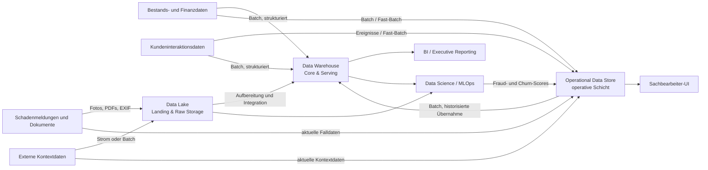

# Hausarbeit Datenmanagement

> **Arbeitsstand:** Entwurf  
> Die hier beschriebene Architekturstrategie ist noch nicht final. Die README
> dient als gemeinsame Arbeitsgrundlage für die Ausarbeitung der Hausarbeit und
> der Architekturvisualisierung.

## Ziel der Arbeit

Für die Allianz SE wird eine hybride analytische Datenarchitektur entworfen.
Das Zielbild kombiniert drei spezialisierte Architekturkomponenten:

- einen **Data Lake** für große Mengen heterogener Rohdaten,
- einen **Operational Data Store (ODS)** für aktuelle operative Daten und
- ein **relationales Data Warehouse (DWH)** für integrierte, historisierte und
  qualitätsgesicherte Daten.

Die Aufteilung ersetzt ein unscharfes Lakehouse-Gesamtmodell durch klar
abgegrenzte Komponenten. Jede Komponente erhält einen eindeutigen Zweck, einen
definierten Datenbestand und nachvollziehbare Datenflüsse. Die finale
Visualisierung wird mit den Symbolen aus der Vorlesungsdatei
[`Notation.pptx`](../Notation.pptx) erstellt.

## Leitgedanke der Architektur

Die Architektur trennt operative und analytische Anforderungen:

- **Aktualität:** Der ODS unterstützt Near-Real-Time-Abfragen und operative
  Entscheidungen.
- **Flexibilität:** Der Data Lake nimmt unstrukturierte und
  semi-strukturierte Daten zunächst schemaflexibel auf.
- **Konsistenz:** Das DWH stellt bereinigte, integrierte und historisierte
  Daten für wiederkehrende Analysen bereit.
- **Governance:** Datenschutz, Datenqualität, Historisierung und regionale
  Datentrennung werden über alle Schichten hinweg berücksichtigt.

## Konzeptionelle Übersicht

Das folgende Diagramm ist lediglich ein Arbeitsmodell. Es ersetzt nicht die
spätere Darstellung in der offiziellen Vorlesungsnotation.



Die direkten Datenflüsse von den fachlichen Quellbereichen zum DWH sind noch zu
prüfen. Als Alternative kann das DWH ausschließlich aus dem ODS und dem
aufbereiteten Bereich des Data Lakes versorgt werden.

## 1. Quellkomponenten

Die Quellkomponenten stehen in der finalen Visualisierung auf der linken Seite.

| Quellkomponente | Datentypen | Verarbeitungsmodus | Beispiele |
|---|---|---|---|
| Bestands- und Finanzdaten | strukturiert | Batch | Verträge, Beiträge, Stammdaten, Buchungsdaten |
| Kundeninteraktionsdaten | strukturiert und semi-strukturiert | Batch, Fast-Batch oder Ereignisse | Kontakte, Kampagnen, Vertragsinteraktionen |
| Schadenmeldungen und Dokumente | strukturiert, semi-strukturiert und unstrukturiert | Strom und Batch | Falldaten, Fotos, PDFs, EXIF-Metadaten |
| Externe Kontextdaten | überwiegend semi-strukturiert | Strom oder Batch | Wetter-, Geo- und weitere Umfelddaten |

## 2. Ingestion und Data Lake

Die Ingestion umfasst die technischen Datenflüsse zwischen Quellen und
Architekturkomponenten. Sie ist zunächst keine eigenständige persistierende
Komponente, sondern wird durch Batch-, Fast-Batch- und Stromverarbeitung
realisiert.

Der **Data Lake** übernimmt insbesondere:

- Schadensfotos und PDF-Dokumente,
- EXIF-Metadaten und weitere semi-strukturierte Daten,
- Freitexte, Telemetrie- und externe Rohdaten,
- große Datenmengen mit zunächst geringer bis mittlerer Aufbereitung.

Der Data Lake dient als kostengünstiger Langzeitspeicher und als flexible
Grundlage für Data-Science-Verfahren. Ob innerhalb des Data Lakes getrennte
Landing-, Raw- und Curated-Zonen dargestellt werden, ist noch offen.

## 3. Operational Data Store

Der **ODS** bildet die operative Schicht. Er wird über Stromverarbeitung oder
Fast-Batch mit aktuellen Schadensmeldungen, Vertragsständen und
Kundeninteraktionen versorgt.

Seine Aufgaben sind:

- Bereitstellung hochaktueller operativer Daten,
- schnelle Abfragen durch die Sachbearbeitung,
- Unterstützung des Near-Real-Time-Fraud-Scorings,
- Zwischenspeicherung aktueller Scores und Bearbeitungszustände.

Der ODS ersetzt keine langfristige Historisierung. Historisch relevante Daten
werden kontrolliert in das DWH übernommen.

## 4. Relationales Data Warehouse

Das **DWH** bildet die Core- und Serving-Schicht. Es wird durch
ETL-/ELT-Pipelines im Batch-Modus aus dem ODS, strukturierten Quellsystemen und
aufbereiteten Daten des Data Lakes gespeist.

Seine Aufgaben sind:

- Integration fachlich zusammengehörender Daten,
- Bereinigung und Validierung,
- Historisierung,
- Schema-on-Write und konsistente Datenmodelle,
- Bereitstellung eines Sternschemas für die Churn Prediction,
- Grundlage für BI-Berichte und reguliertes Reporting.

Sensible Krankenversicherungsdaten werden vor ihrer analytischen Nutzung
abhängig vom Zweck anonymisiert oder pseudonymisiert. Die genaue Position
dieses Verarbeitungsschritts im Datenfluss ist noch festzulegen.

## 5. Analysekomponenten und Datensenken

### BI und Executive Reporting

Die BI-Komponente greift auf das DWH zu. Sie stellt standardisierte Berichte,
Kennzahlen, Quartalsauswertungen und Informationen für regulatorische
Berichtsanforderungen bereit.

### Data Science und MLOps

Die Data-Science-/MLOps-Komponente verwendet:

- DWH-Daten für das Training und die Ausführung des Churn-Modells,
- Daten aus dem Data Lake für Bild-, Text- und weitere komplexe Analysen,
- gegebenenfalls aktuelle ODS-Daten für operative Modellaufrufe.

Ob Feature Store, Model Registry und Scoring Service als eigene Komponenten
dargestellt werden, ist noch zu entscheiden.

### Operatives Sachbearbeiter-UI

Das Sachbearbeiter-UI greift auf den ODS zu. Es zeigt aktuelle Falldaten und
Fraud-Scores an und unterstützt die Priorisierung einer manuellen Prüfung. Ein
Score soll eine fachliche Entscheidung unterstützen, sie aber nicht
automatisch ersetzen.

## Integration der Use Cases

### Use Case 1: Fraud Detection bei Kfz-Schäden

1. Eine Schadenmeldung wird über einen digitalen Schadenkanal erfasst.
2. Aktuelle strukturierte Falldaten und Metadaten gelangen in den ODS.
3. Fotos, Dokumente und umfangreiche Metadaten werden im Data Lake gespeichert.
4. Ein Scoring-Prozess kombiniert aktuelle Falldaten mit aufbereiteten
   Merkmalen.
5. Der Fraud-Score wird im ODS abgelegt und im Sachbearbeiter-UI angezeigt.
6. Daten und Prüfergebnis werden für spätere Analysen und Modelltrainings
   historisiert.

### Use Case 2: Churn Prediction in der Krankenversicherung

1. Vertrags-, Beitrags-, Schaden- und Kundeninteraktionsdaten werden im DWH
   integriert.
2. Die Daten werden historisiert und für das Sternschema aufbereitet.
3. Eine Batch-Pipeline erzeugt Trainings- und Scoring-Merkmale.
4. Das freigegebene Modell berechnet regelmäßig Churn-Scores.
5. Die Ergebnisse werden dem Kundenmanagement für fachlich und rechtlich
   zulässige Kundenbindungsmaßnahmen bereitgestellt.

## Umsetzung in der Vorlesungsnotation

Für die finale Abbildung werden die Elemente aus `Notation.pptx` konsequent
verwendet:

| Inhalt | Darstellung in der Vorlesungsnotation |
|---|---|
| fachliche Quellbereiche | Quellkomponenten |
| Data Lake, ODS und DWH | Architekturkomponenten |
| BI und Data Science / MLOps | Analysekomponenten |
| Sachbearbeitung oder Kundenmanagement | Datensenken bzw. operative Verbraucher |
| periodische Übertragung | Batch-Verarbeitung |
| kontinuierliche Ereignisse | Stromverarbeitung |
| Tabellen und Stammdaten | strukturierte Daten |
| JSON, Logs und EXIF | semi-strukturierte Daten |
| Fotos, PDFs und Freitexte | unstrukturierte Daten |
| DWH-Aufbereitung | Integration, Bereinigung, Historisierung und Aggregation |
| Schutz sensibler Daten | Anonymisierung oder Pseudonymisierung |

Die Pfeile müssen erkennen lassen:

- welche Daten übertragen werden,
- ob Batch- oder Stromverarbeitung vorliegt,
- wo Daten aufbereitet und historisiert werden,
- welche Komponente welchen Use Case unterstützt.

## Noch offene Entscheidungen

- Direkte DWH-Beladung aus fachlichen Quellbereichen oder ausschließlich über
  den ODS
- Abgrenzung zwischen Streaming und Fast-Batch
- interne Zonen des Data Lakes
- Speicherort und Lebenszyklus der Fraud- und Churn-Scores
- Darstellung eines Feature Stores und eines Scoring Service
- technische Umsetzung der regionalen Datentrennung
- Zeitpunkt und Verfahren der Anonymisierung oder Pseudonymisierung
- Aufbewahrungs- und Löschfristen je Datenklasse
- Auswahl der tatsächlich benötigten externen Kontextdaten
- Rückfluss von Modell- und Prüfergebnissen für das Retraining
- Monitoring von Datenqualität, Modellgüte und Model Drift

## LaTeX-Projekt

### Bauen

Im Ordner `Latex`:

```sh
latexmk -pdf main.tex
```

Alternativ:

```sh
pdflatex main.tex
bibtex main
pdflatex main.tex
pdflatex main.tex
```

Die fertige Datei liegt unter `Latex/main.pdf`.

### Wichtige Verzeichnisse

- Metadaten und Titelseite: `Latex/main.tex`
- Inhalt: `Latex/chapters/`
- Literatur: `Latex/bib/quellen.bib`
- Abbildungen: `Latex/images/`
- Abkürzungen und Abstract: `Latex/frontmatter/`
